# Sổ Văn Bản Đi 📒

**Phần mềm mã nguồn mở quản lý sổ văn bản đi** cho cơ quan, doanh nghiệp Việt Nam — thay thế sổ giấy ghi tay bằng hệ thống web: đánh số tự động chống trùng, tra cứu tức thì, in sổ A4 ngang đúng chuẩn lưu hành, xuất Excel, đính kèm file văn bản, **kèm Trợ lý AI (OCR + tìm kiếm ngữ nghĩa + hỏi đáp RAG)**.

> **Bản phát hành: v1.0.1** · Giấy phép MIT · Giao diện tiếng Việt, dùng tốt trên máy tính và điện thoại.

---

## ✨ Tính năng

| # | Tính năng | Mô tả |
|---|---|---|
| 1 | **Sổ văn bản đi** | Bảng sổ 11 cột bám đúng sổ giấy: số vào sổ, số ký hiệu, loại văn bản, ngày ban hành, người ký, trích yếu, nơi nhận, số bản… |
| 2 | **Đánh số tự động** | Tăng dần theo năm, chống trùng tuyệt đối (tính trong transaction + bảng đếm năm); hiển thị trước số kế tiếp khi nhập |
| 3 | **Số ký hiệu theo mẫu** | Ghép linh hoạt theo quy ước cơ quan, VD `36/2026/CV-UBND` = `{số vào sổ}/{năm}/{ký hiệu loại}-{viết tắt cơ quan}` |
| 4 | **Tìm kiếm / lọc tức thì** | Theo từ khoá, số ký hiệu, người ký, ngày tháng, loại văn bản, nơi nhận; có phân trang |
| 5 | **In sổ + xuất Excel/PDF** | In A4 ngang có tiêu đề cơ quan, dòng chữ ký "TRƯỞNG ĐƠN VỊ" — in bằng trình duyệt, hỗ trợ tiếng Việt chuẩn |
| 6 | **Nhập Excel sổ cũ** | Tải file Excel mẫu → map cột → nhập loạt văn bản cũ một lượt, có báo cáo từng dòng |
| 7 | **Đính kèm file** | PDF / DOC / DOCX / JPG / PNG, tối đa 20MB/file, tên tiếng Việt hỗ trợ đầy đủ |
| 8 | **Phân quyền 3 cấp** | `ADMIN` (toàn quyền, quản trị người dùng) · `VANTHU` (nhập/sửa) · `TRACUU` (chỉ tra cứu) |
| 9 | **Nhật ký hoạt động** | Ghi lại ai tạo / sửa / xoá văn bản, lúc nào — phục vụ đối chiếu và kiểm tra |
| 10 | **Bảo mật** | JWT (access 15 phút + refresh 7 ngày), bcrypt, giới hạn 10 lần đăng nhập/phút/IP, đổi mật khẩu tự phục vụ |
| 11 | **Sao lưu tự động** | `pg_dump` + nén file đính kèm hằng ngày lúc 02:00, giữ 30 bản, khôi phục 1 lệnh |
| 12 | **🤖 Trợ lý AI** (v1.0.1) | **OCR nhận dạng văn bản** tự điền form nhập · **Tìm kiếm ngữ nghĩa** (RAG: embed + pgvector + rerank kiểu Cherry Studio) · **Hỏi đáp** trả lời dựa trên sổ, kèm nguồn tham chiếu — dùng được cả **Ollama local** (dữ liệu không rời VPS) lẫn **API provider OpenAI-tương-thích** |

## 🖼 Màn hình giao diện

### Đăng nhập
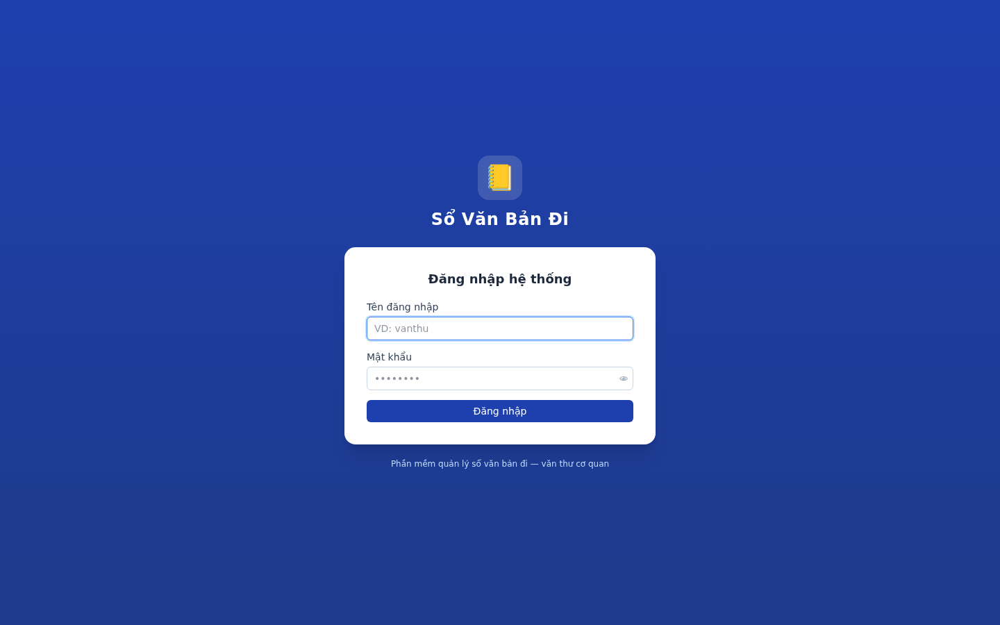

### Sổ văn bản đi — màn hình chính
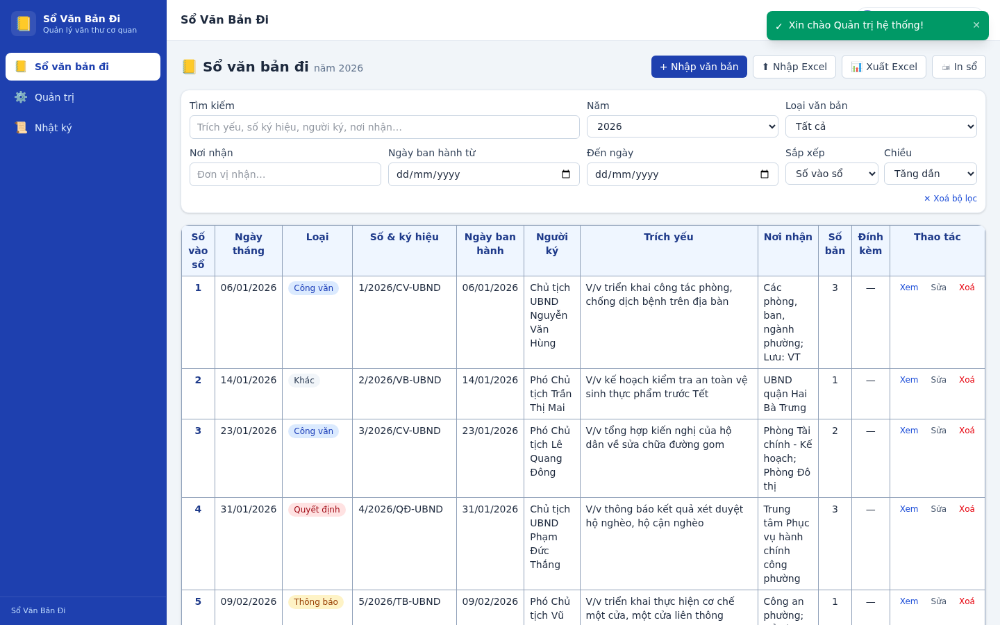

### Tìm kiếm / lọc trong sổ
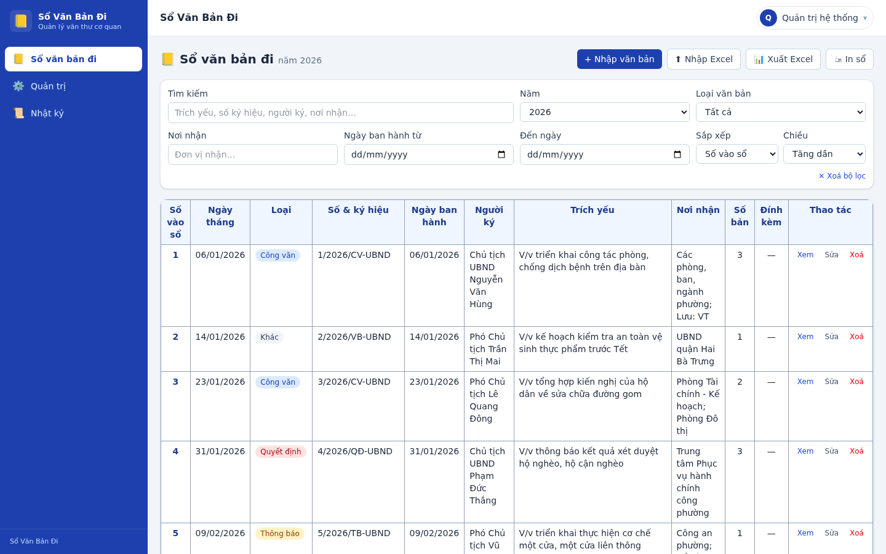

### Chi tiết văn bản
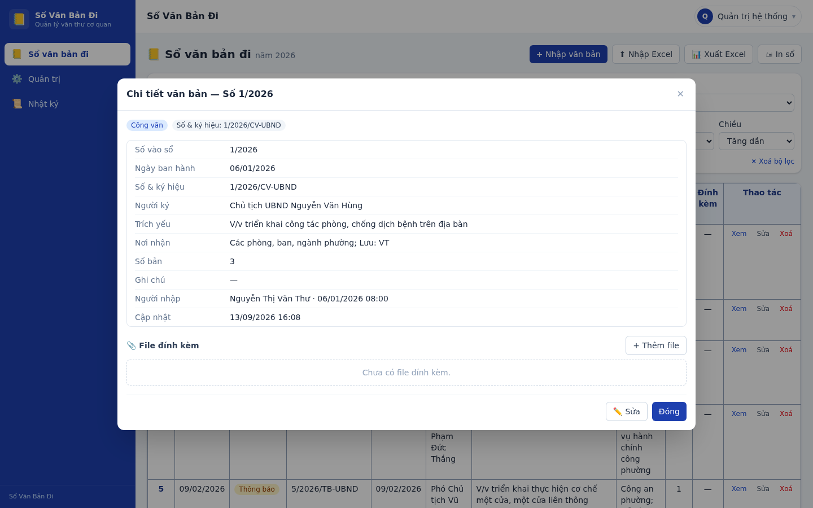

### Nhập văn bản mới
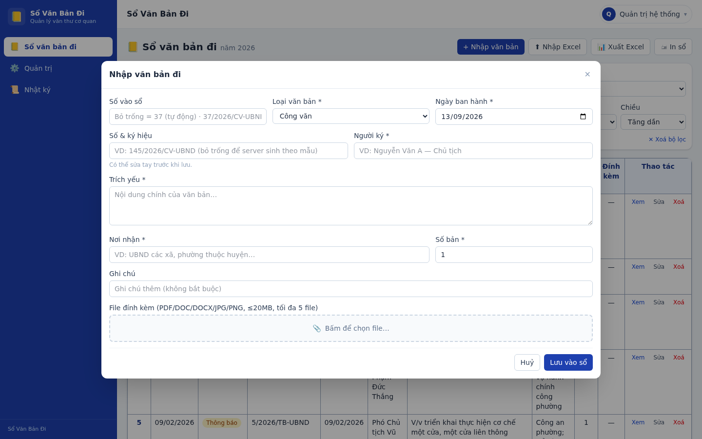

### In sổ A4 ngang (chuẩn lưu hành)
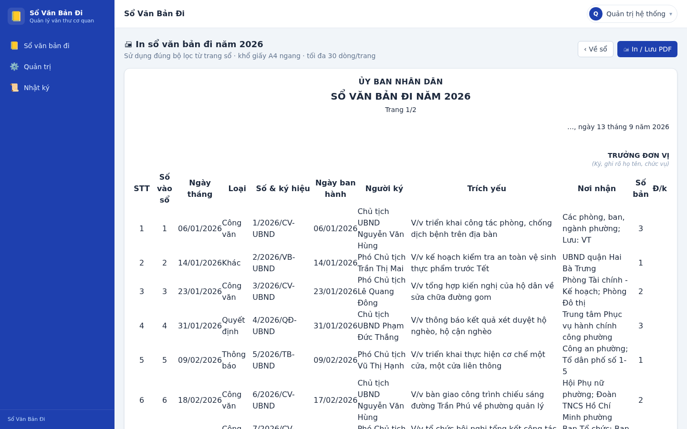

### Nhập sổ cũ từ Excel
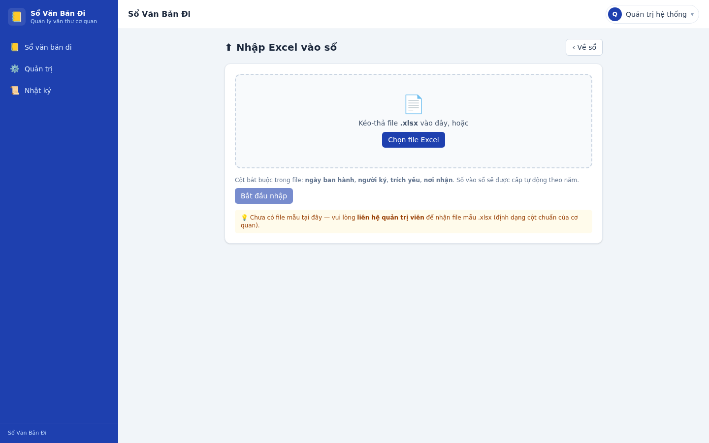

### Quản trị người dùng
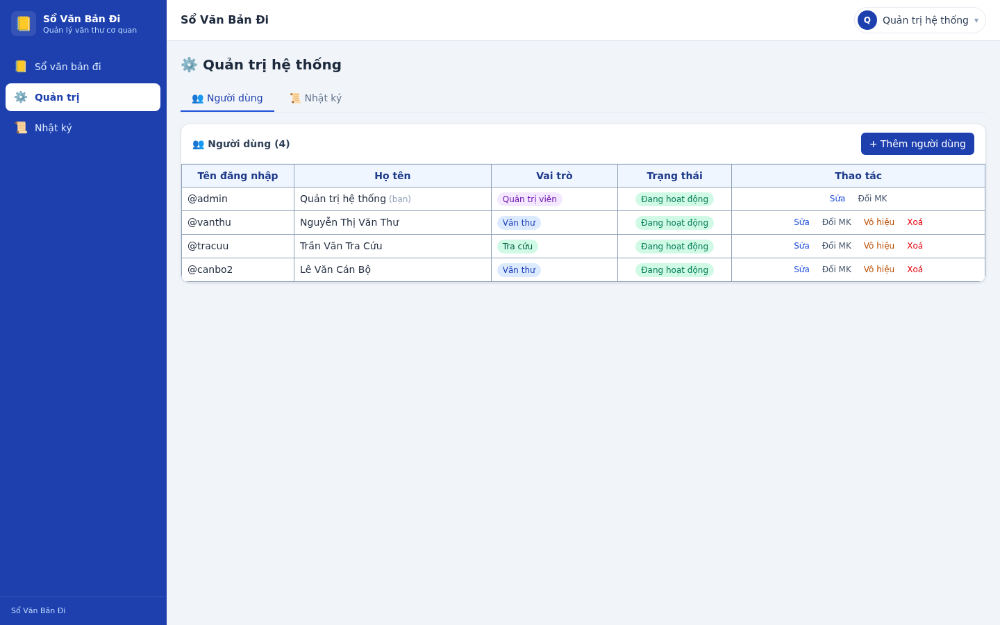

### Nhật ký hoạt động
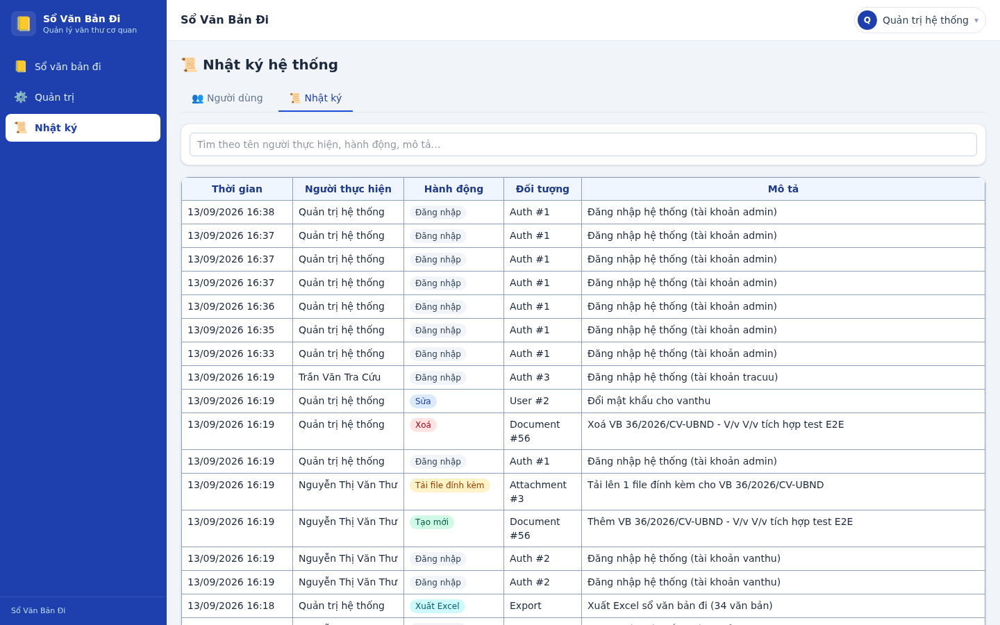

### Trên điện thoại
<p>
  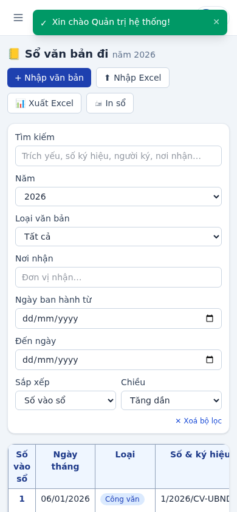
  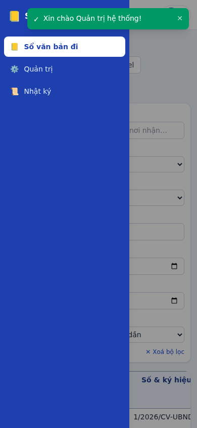
</p>

### 🤖 Trợ lý AI (v1.0.1)

#### Hỏi đáp RAG — trả lời kèm nguồn tham chiếu
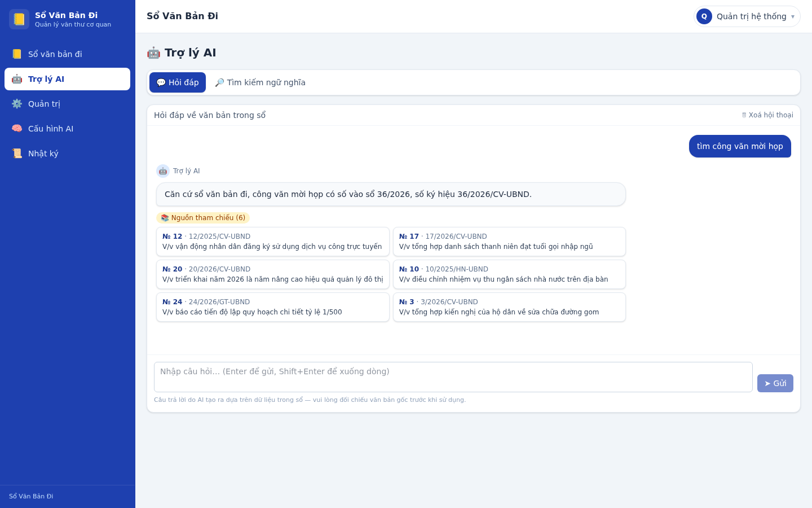

#### Tìm kiếm ngữ nghĩa (embed + pgvector + rerank)
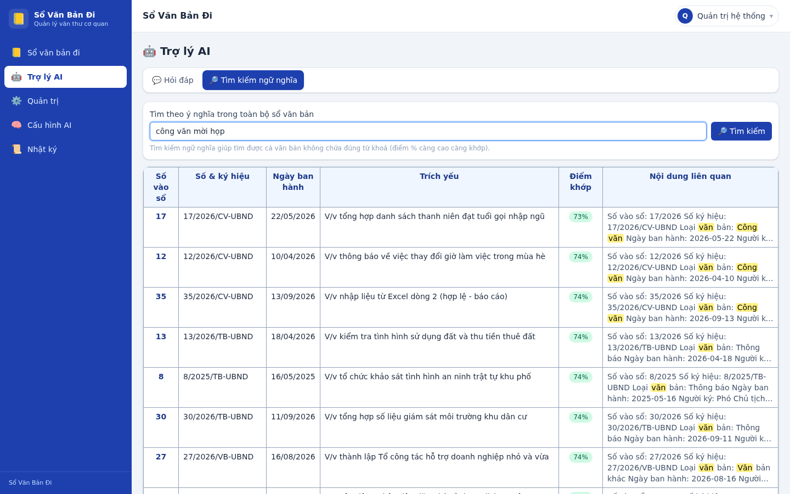

#### Cấu hình AI — API provider (Base URL + API key)
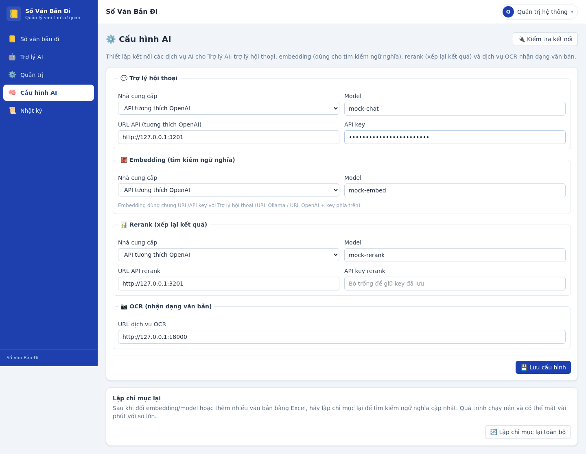

#### Cấu hình AI — Ollama chạy tại chỗ (URL Ollama)


#### OCR tự điền form nhập từ ảnh/PDF
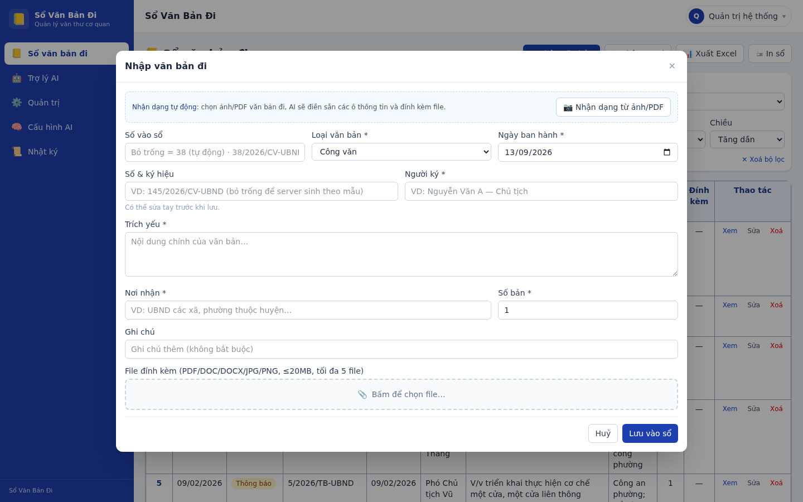

#### Trợ lý AI trên điện thoại
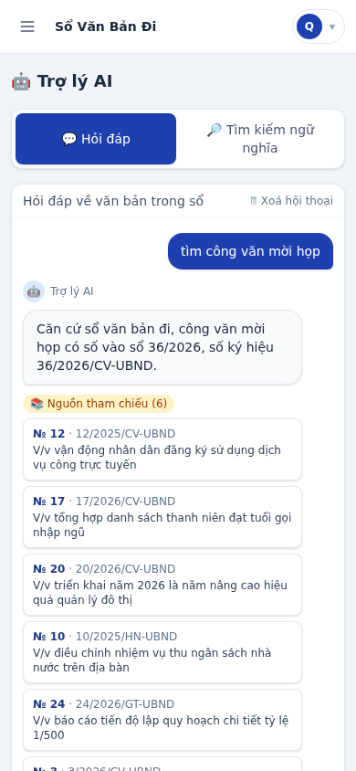

## 🧱 Kiến trúc & công nghệ

```
                    ┌─────────────────── Cloudflare (proxy + SSL) ───────────────────┐
                    │                                                                │
   Người dùng ────► Caddy (reverse proxy, cấp SSL tự động qua DNS-01) ────► App container
   (PC / mobile)          :80/:443                                    Node.js 22 + Fastify 5
                                                                        │  phục vụ web build (React 18 + Vite + TS + Tailwind v4)
                                                                        │
                                        ┌───────────────────────────────┼──────────────┐
                                        │                               │              │
                                  PostgreSQL 16                    Volume uploads   Container backup
                                  + pgvector (RAG)                 /data/uploads    (pg_dump + tar hằng ngày)
                                        │
                                  Container OCR (PaddleOCR tiếng Việt) · Ollama (tuỳ chọn, profile "ai")
                                        · Uptime Kuma (tuỳ chọn, profile "monitor")
```

- **Backend:** Node.js 22 · Fastify 5 · Prisma 6 + PostgreSQL 16 (pgvector) · JWT · Zod · bcryptjs · exceljs
- **Frontend:** React 18 · Vite · TypeScript · Tailwind CSS v4 · react-router-dom v7 · react-hot-toast
- **AI (v1.0.1):** PaddleOCR (tiếng Việt, container riêng) · Ollama / API OpenAI-tương-thích · pgvector (embed + rerank kiểu Cherry Studio)
- **Triển khai:** Docker Compose (dev + prod) · Caddy 2 (SSL tự động qua Cloudflare DNS-01) · script backup/restore · profile `ai` (Ollama) + `monitor` (Uptime Kuma)
- **Mô hình dữ liệu:** `User` · `Document` (unique `[soVaoSo, nam]`) · `Attachment` · `AuditLog` · `YearCounter` · `AiConfig` · `DocumentChunk` (vector)

## 🚀 Chạy nhanh (môi trường phát triển)

Yêu cầu: Docker + Docker Compose.

```bash
cp .env.example .env
docker compose up --build
# → Frontend: http://localhost:5173   ·   API: http://localhost:3000/api
```

Tài khoản mẫu (tự tạo khi CSDL trống lần đầu):

| Vai trò | Tài khoản | Mật khẩu |
|---|---|---|
| Quản trị | `admin` | `Admin@123` |
| Văn thư | `vanthu` | `VanThu@123` |
| Tra cứu | `tracuu` | `TraCuu@123` |

> ⚠️ **Đổi ngay mật khẩu admin** trước khi đưa vào sử dụng thực tế.

## 🌍 Triển khai production (VPS + Cloudflare)

Hướng dẫn từng bước cho quản trị viên — từ thuê VPS, đưa tên miền lên Cloudflare, cấp SSL tự động, đến chạy lệnh triển khai:

👉 **`docs/DEPLOY-CLOUDFLARE.md`** (8 bước, mỗi bước 5–15 phút)

Bản tóm tắt: VPS 2vCPU/4GB (Ubuntu 24.04) → DNS record A (proxy bật) → SSL Full (strict) → Cloudflare API Token (Zone.DNS Edit) → cài Docker → `cp .env.example .env && nano .env` → `./scripts/deploy.sh`.

## 📚 Tài liệu

| Tài liệu | Nội dung |
|---|---|
| `docs/USER-GUIDE.md` | Hướng dẫn sử dụng cho nhân viên văn thư (nhập sổ, tra cứu, in sổ, Excel, FAQ) |
| `docs/API.md` | Hợp đồng API đầy đủ cho lập trình viên |
| `docs/AI.md` | **Cấu hình & sử dụng Trợ lý AI** (Ollama local / API provider / OCR / RAG) |
| `docs/DEPLOY-CLOUDFLARE.md` | Triển khai production trên VPS + Cloudflare |
| `scripts/backup.sh` / `restore.sh` | Sao lưu & khôi phục dữ liệu |
| `scripts/screenshot.mjs` | Chụp lại toàn bộ ảnh màn hình (Playwright + Chrome hệ thống) |

## 🔧 Vận hành hằng ngày

```bash
./scripts/deploy.sh logs                                                    # xem log ứng dụng
git pull && ./scripts/deploy.sh                                             # cập nhật phiên bản mới
docker compose -f docker-compose.prod.yml exec backup sh /backup.sh --once  # sao lưu thủ công
./scripts/restore.sh backups/db-<ngày>.sql.gz backups/uploads-<ngày>.tar.gz # khôi phục
```

Sao lưu tự động chạy lúc **02:00 mỗi ngày**, giữ **30 bản gần nhất** trong volume `backups`.

## 🔐 Chứng thực số vào sổ (chống trùng)

Mỗi văn bản khi nhập được cấp số vào sổ trong **một transaction PostgreSQL**:

```sql
INSERT INTO "YearCounter" ("nam", "last") VALUES ($1, 1)
  ON CONFLICT ("nam") DO UPDATE SET "last" = "YearCounter"."last" + 1
  RETURNING last AS soVaoSo;
```

→ Không bao giờ hai văn bản trùng số vào sổ cùng năm, kể cả khi nhiều văn thư viên bấm "Lưu" cùng lúc.

## 🤝 Đóng góp

Mã nguồn mở theo giấy phép **MIT** — tự do sử dụng, chỉnh sửa và phân phối. Mọi PR / issue đều hoan nghênh.

## 📄 Giấy phép

MIT — xem [LICENSE](LICENSE).
